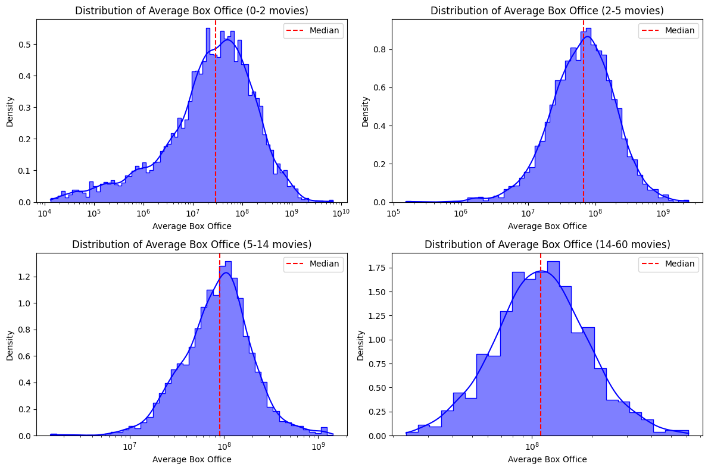
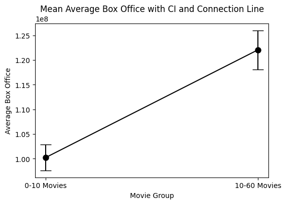

    

## Meeting invitation

Welcome to Blockbuster Inc., the only movie producer obsessed on achieving the highest financial results in the film industry. You have the chance to take part of our latest board meeting, where our hard working interns sum up their most promising findings. During this meeting of the highest importance, they will expose the secret sauce that turns a movie into a worldwide success. In case you would be reluctant to attend this summit, be assured that the investigation presented will be ground-breaking, since our newly hired interns were given unlimited access to our next generation quantum compute clusters and were generously compensated for their job. We strongly encourage you to attend the meeting. Stay tuned!

**Name of our talented interns:** Adam Benslama, Dusan Cvijetic, Gilles Moreillon, Marko Simic, Romain Pythoud 

## Start of the meeting

### 8:00-8:30: Introduction to the dataset | Speaker: Romain

For this investigation, the CMU Movie Corpus dataset will be used to take a dive into the realms of movie industry. This dataset includes movie titles, featured actors, related genres, corresponding box office revenues and more. Regrettably, the dataset does not include any information on movies ratings, a useful component of our analysis as it includes the overall public perception. To adress this issue, we supplemented the main dataset with the IMDb Movie Dataset, which provides the movie ratings. 

Furthermore, a quick look at the main dataset shows that most of the box office revenues data related to the films are missing. This observation is confirmed by the following plot.

    

Although the proportion of missing revenues data is high, an analysis on the overall box office revenues could still provide relevant insights as the total number of remaining is still significant.

A plot of the movie revenues over the years is done below.

    

From this plot, we can see that the increase of movie revenues over the years follow an exponential distribution. This is further confirmed by the positive slope of the linear regression on the log axis of the data points. This exponential increase in box office revenues over the years is due to the compounding effect of monetary inflation year over year. We can take into account this effect by adjusting the revenues in usd using inflation data provided by the US Consumer price index (CPI). Although other effects can affect the revenue distribution over the years like the size of the adressable market, the resulting plot is a more reliable representation of the financial success of a movie through history.

    

### 8:30-9:00: Movie genres clustering | Speaker: Adam



We created a pie chart to visualise how the movie genres are distributed. This allow us to have a quick look at the movie distribution, assigned to the main genres.

The genre "Drama & Romance" is the most common in the dataset, making up a quarter of the movies. "Comedy" and "Action & Adventure" also represent significant portions, while "Horror & Thriller" and "Crime & Mystery" are less represented but still significant.

The "Others" category, which represents the aggregated total of the least common genres, makes up a larger slice than two individual genres, indicating that the movies genres follows a heavy-tailed distribution.

But so far, this analysis doesn't say much about the changes over time and how they are distributed with respect to the revenue they generated. The next plot should be more informative in this regard.



The advantage of this graph, compared to the pie chart, is the evolution over time. This allows us to have a combined visualization of the main genres evolution over time. Now, we can observe trend shifts from this plot.

In the early 20s, we observe that Drama & Romance as well as Action & Adventure were the only genres included in the dataset. In particular we can observe the decrease in the "Drama & Romance" dominance over time, shifting from a 60% to a 20% market share over the years. Comedy as well as Action & Adventure has followed a steady trend. Horror and thriller movies have sustained a modest growth over time.

Overall, the graph suggests a poor diversity at the beginning of the 1900's, but the cinematographic industry since has vested into a variety of other movie genres.

For the next step, we wanted to direct our attention to the average box office revenue generated by each genre. We have created an interactive plot where you can select the average revenue distributions from our larger set of 10 genres.



Since we adjusted the revenu of each movie with the inflation, we are now allowed to calculate the mean revenue for each genre through the all time span.

We are well aware that other factors than inflation can have an effect on the financial performance of a movie like money invested, the number of cinemas and their affordability (price of ticket).

Here, we did the same analysis as for the genre but with the language instead. We kept the six most frequent movie languages. We wanted an easy and quick visualization used for comparison of the movie languages. From these plots, we can compare languages from the same period and also observe the evolution of each language over time. To get a smoother aspect of the plot, a moving average was performed. This removes the short term fluctuations and allows to analyze trends, although at the cost of loosing a bit of granularity in the data points.

With our analysis, we could in theory predict future box office by basing our assumptions on the trends and evolution over time. For this reason, the smoothing of our data is well suited.

    

To enhance further our understanding of the data distribution, we will delve into a more informative type of data representation.

    

Violin plots are useful because they immediately provide the density of the distribution, the median, quartiles range as well as the outliers.

This plot in particular is interesting because some languages, like German anf French, have a wider range of revenues (potentially indicating both low and high gross revenues of movies). Others, like Korean and English, have a narrower distribution (potentially more consistent revenue figures). Finaly, some languages, like the Korean, has a high density of data around the median revenue, as indicated by the thickness of the violins.

    

We can infer from the movie runtime plot there seems to be no linear relationship between revenue and runtime. However, the movie runtime data seems normaly distributed around 100 minutes of movie duration. This is a useful indication to identify the most suited movie runtime associated to the highest box office revenues.

An other question can arise. Do higher box office revenues unequivocally translates into better ratings? The following histogram displaying the average box office revenues per rating seems to go in that direction.

    

We computed and displayed the mean revenue of the movies with respect to their rating. Unsurprisingly, the graph indicates the higher the ratings, the higher the box office revenues will be. This suggests that, on average, higher-rated movies tend to generate more revenue at the box office.
The highest revenue is associated with movies that have an average rating of 9.0, which is significantly higher than all other ratings. The lowest box office revenue is associated with movies that have the lowest average ratings (1.5 to 2.5). Overall, we concur that a few high-grossing blockbusters could skew the average revenue upward for a particular rating. For example, the data doesn’t account for other factors that can influence box office revenue, such as marketing budgets, the presence of star actors, genre, seasonal release dates, and competition from other movies at the time of release.

### 9:00-9:30: Coffee break

    

### 9:30-10:00: Gender and revenues relationship | Speaker: Gilles

Genders of the cast may be an important factor to the financial succcess of the movies. First, let's have a look at the total count of actors over the years, splitted by their gender.

    

As for the box office revenues, the availability of data regarding the gender distribution of the cast is constrained to the century spanning from 1910 to 2010. We will thus limit ourselves to this time span for further analysis. A graph that is significantly more informative is the percentage of male vs female characters proportion in the cast of movies over the years. The following graph reveals a relatively stable ratio over time with minor fluctuations, so we can't extract any particular trend from this plot. A modest decline is observed as we approach 2010, likely indicative of gradual shifts in gender representation. The abrupt rise thereafter suggests a data irregularity due to a smaller sample size in recent years, rather than a genuine trend reversal. This highlights the importance of considering sample size when interpreting data, as anomalies may distort the understanding of long-term patterns.

    

We'll then proceed by aggregating the distribution of gender for each decade but by keeping only the actors that featured in the 20% most successful movies, both in terms of box office and ratings. This could uncover different significant observations. Overall, both plots look very similar, which suggests again that the overlap between good ratings and high revenues is significant and that the difference between the two subsets is minimal. Despite fluctuations, the overall pattern reveals the predominance of male characters through the cinematographic history. Contrary to the hypothesis that higher-rated movies might exhibit a more diverse cast, our findings indicate that both box office success and high ratings show similar patterns of female participation. Notably, there is a recent uptick in female representation, suggesting a positive trend worth further exploration for those seeking to maximize box office potential without compromising ratings. The recent increase in the percentage of women is a noteworthy development. To stay on the cutting edge of money generation, let's delve deeper into the recent evolution of female representation and seize the opportunity to enhance both profitability and ratings. This sets the stage for a more in depth analysis, potentialy exploring factors influencing these trends.

    

Once again, we'll group years to compare averages in a more meaningful manner. This approach gives rise to a new metric: Performance. Performance evaluates a movie's box office (or rating) in relation to the average for movies within the same year group (decades so far). This metric aims to mitigate the impact of inflation, as well as factors such as the increasing number of ticket sales, providing a more nuanced understanding of a movie's success.

    

The dataset uncovers a significant decline in box office performance when movies feature more than 40% female actors, in stark contrast to rating performance, which maintaining a small range of around 5% in performance difference. Historically, movies with fewer female actors tended to outperform financially. However, as industry trends undergo a rapid evolution, it's crucial to consider both current and future implications...

While the primary focus is on box office success, it appears that gender has a limited effect on our movie ratings. Based on these analyses, historical data suggests that a lower percentage of women in movies yielded the best financial results. However, recognizing the changing landscape, let's delve into the evolution of these trends and ensure to keep up with recent trend to avoid potential missteps.



In this decade by decade interactive visualisation, we can observe a bit of nuance on the data that we had over the entire dataset. The data consistently reveals that the percentage of female actors has historically had and continues to have a limited impact on ratings. For revenue, however, the trend is quite different. Although the effects become less extreme with a higher proportion of women (as long as it remains close to 50%), it still appears that, to maximize profit, even in the most recent years, a focus on a higher proportion of male actors is advisable.

As the film industry undergoes transformations, there's evidence to suggest that this trend is waning, signaling a move towards a more equitable gender representation. We need to acknowledge the rapidly changing times, and it may be prudent to seek more recent data to stay on the cutting edge of box office dynamics. However, current indications suggest that maintaining a lower percentage of female actors remains a more lucrative approach for revenue maximization in the film industry.

### 10:00-10:30  Influence of actors' fame on revenue | Speaker: Marko

We want to quantify the actors' fame in some way. We decided to consider actor's career span, number of movies they starred in, average box office revenue and the average rating of movies they appeared in. Let's delve right in.

In this segment, we are creating a new data frame that focuses on key information about each actor. Initially, we remove any instances of NaN values to ensure the accuracy of our data. The primary columns of this data frame grouped by actors include the average Weighted Rating, Number of Movies, Years of Casting, and Average Box Office.

The Weighted Rating column is particularly insightful as it considers the Average Rating of the IMDb dataset weighted by the number of votes, thus providing a more comprehensive view of their acclaim. To compute the Years of Casting for each actor, we determine the span of their career by subtracting the year of their last movie from the year of their first movie. This approach gives us a reliable duration of each actor active years in the film industry.

First, let's explore the actor-centric metrics and their films' average box office revenues using scatter plots and statistical correlation analysis.

    

    

    

The Pearson correlation coefficients provide a quantifiable measure of how these factors are related, although it's important to note that a correlation does not imply causation. We'll look at the p-value, which will help us understand if the link we see in our data is meaningful or just happened by chance. In all cases above, the Pearson correlation coefficients indicate weak to modest relationships between the features. Furthermore, the computed p-value are very low, which consistently point to these relationships being statistically significant. This means that despite the low strength of the linear correlations, the relationships between these variables are consistent and unlikely to be due to random fluctuations in the data. Overall, an increased number of movies or a longer cinematographic career translate to movies with higher box office revenues. As expected, higher ratings translates to higher box office revenues on average.

One way to assess the strength between actor-centric metrics relationship is to perform the Principal Component Analysis (PCA). The PCA analysis can in particular be used to uncover which variable is the most influential. The following tables collect the computed explained variance ratio for each of these components, thus indicating how much of the total variance in the data each component accounts for.

| Principal Component | Explained Variance Ratio  |
|---------------------|---------------------------|
| 1                   | 0.5805                    |
| 2                   | 0.3110                    |
| 3                   | 0.1085                    |

and their relative contributions:

| Variable            | Contribution |
|---------------------|--------------|
| Weighted Rating     | 0.2884       |
| Years of casting    | 0.6789       |
| Number of movies    | 0.6752       |

The next step is to compute the coefficient of determination denoted as R², for each model. This statistical measure represents the proportion of the variance in a dependent variable which is the Average Box office revenue, that is predictable from a second independent variable. In our case, there are only 3 features to consider.

These values help us understand the effectiveness of each actor-centric metric ('Weighted Rating', 'Years of Casting', 'Number of Movies') in predicting the average box office revenue. A higher R² value suggests a stronger relationship between the independent variable and the average box office revenue. The results are shown on the following table and since they are very low, it suggests that none of these individual metrics are strong predictors of an actor's average box office revenue when considered independently. This highlights the complexity of identifying box office success predictors, successes which are likely influenced by a multitude of factors beyond these individual metrics.

| Variable            | R^2          |
|---------------------|--------------|
| Weighted Rating     | 0.033        |
| Years of casting    | 0.002        |
| Number of movies    | 0.001        |

In many real-world datasets, especially those related to social phenomena like movie financial results, the distribution of their values can be heavy-tailed. This means that a large proportion of the data points are gathered in the lower range (like actors with few movies), but there's a long tail in the distribution representing significant cases (like actors with many movies). Standard statistical methods might not effectively capture the characteristics of such distributions. For this reason, we decide to use the Complementary Cumulative Distribution Function of our toolbox, to better capture the data distribution.

The use of logarithmic scaling in the y-axis ('log' scale) helps in better visualizing and interpreting data that spans several orders of magnitude, which is often the case with heavy-tailed distributions like box office revenues.

    

        
    

    

        
    

In both cases, the CCDF plots shows a linear trend in the logscale plot, which is typical of heavy-tailed distributions. This fact will have to be kept in mind when we divide the data into smaller subsets of similar sizes. In fact, we can divide the data into groups of similar sizes, following a logarithmic distribution like the heavy-tailed distribution of revenues. The following histograms implement this kind of procedure and show the average results by increasing steps of aggregated number of movies an actor has participated in.

    

The plots clearly show a shift of the distribution to the right of the average box office when considering groups of increasing filmography volumes. The next step is to verify scientificaly, with the help of hypothesis testing, if actors with higher number of movies indeed feature in financially more successful movies.

To do so, let's first divide the dataset into two groups of similar sizes and plot their average box office distributions.

    

Then, the t-test enables us to check if there's a noticable difference in the distribution of revenues from two groups of actors defined previously. The first group includes actors who have been in 0 to 10 movies, and the second group consists of actors who have been in 10 to 60 movies. Following this, the code creates a plot showing the average box office earnings for each group. Alongside these averages, it also displays their 95% confidence intervals.

    

The magnitude of the T-statistic is quite large, suggesting a significant difference between the two groups. In other words, the larger the absolute value of the T-statistic, the greater the evidence against the null hypothesis, which states that there is no difference between the groups.

The P-value being extremely small (in this case, approximately 2.83e-19) is a strong indication to reject the null hypothesis meaning there is indeed a strong implied difference for actors with higher number of movies featured in.

We can perform the same kind of analysis but with respect to the Career Length of actors instead of the total number of movies they featured in. Furthermore, we'll aggregate the data by average weighted rating instead of box office revenues. This time, we present the results in an interactive plot, where each position of the slider corresponds to a different movie group, enabling users to observe not only how the density of average box office revenue varies but also the distribution of weighted average ratings within each group. This dual focus on both average box office revenue and weighted ratings offers a comprehensive view of an actor's filmography.



### 10:30-11:00 Topic analysis, summaries processing | Speaker: Dusan

### 11:00-12:00 Business lunch with the board and closing statement

As we delve into the intricate details of our data analysis, it becomes evident that the successful recipe for a blockbuster involves not only the mastery of storytelling but also a keen understanding of audience preferences and the many parameters at bay. We don’t yet have the best plot planned out, but thanks to those insightful analysis, we can already head in the right direction to maximize our chance of being the next wonder of cinema ! 

In our pursuit of excellence, we've identified
First thing first, our movie will need to be a “ Genre from Adam “ (I assume it’s Action and Adventure). For this upcoming action film, we recognize the need for a nuanced exploration of these themes, blending heart-pounding action sequences with emotionally resonant storytelling. It will have to be in English, ensuring that the narrative reaches out to the maximum audience and can speak to consumers across the globe.

In alignment with our commitment to diversity and inclusivity, who’s ethics is only a secondary concern, our analysis indicates the importance of featuring a cast that reflects the richness of the global audience. Hence, we've set a target of 30-40% female representation in prominent roles. This decision not only aligns with societal trends but also opens the door for fresh perspectives and a more dynamic on-screen chemistry.

Not only that, but we need the most famous and experienced actors that we can find. A star-studded ensemble, enlisting only the ones with extensive portfolios. Quantity over quality. These cinematic icons bring not only their acting prowess but also a loyal fanbase, guaranteeing heightened anticipation for our film.

Now that we have the genre of the movie, our cast of wonderful actors, the last step to help us would be to have the best possible topic in mind. After careful investigation of the topics from the best movies, we conclude that we will need a compelling narrative theme that resonates universally : “ Insert Dusan topic”

As we meticulously curate this cinematic experience, Blockbuster Inc. is excited to deliver an “action-packed (if that’s correcte)” spectacle that transcends will put all the odds in our favor ! “Stay tuned for the grand unveiling of our magnum opus, where love and family take center stage amidst the adrenaline-pumping sequences that define the action genre.” (Si c’est bien ce que j’ai compris des conclusion e Dusan et Adam)

